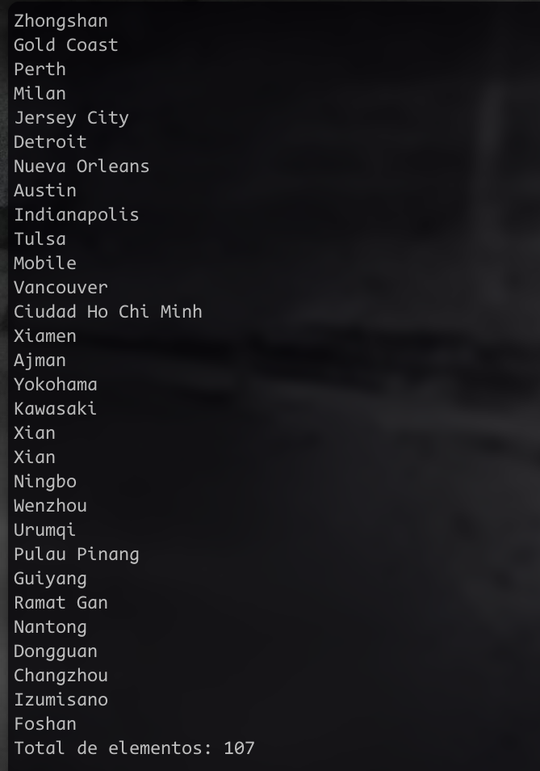
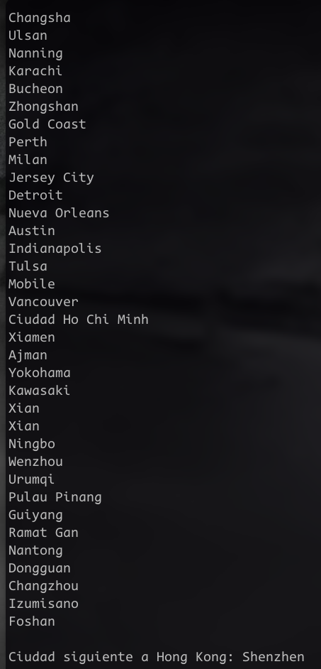

# Ejercicio 23 

En este archivo adjunto capturas del código funcionando

## Tarea 1. 
Descargar el archivo suc1.txt, guardarlo como sucursales.txt y ejecutar el
programa. La salida es:
a) 104
b) 105
c) 106
d) 107

### Resultado

## Tarea 2 
Eliminar la ciudad Chicago, listar nuevamente el conjunto de sucursales. Dada
la ciudad Hong Kong, la que le sigue en la lista es:
a) Buenos Aires
b) Tokio
c) Shenzhen
d) Cleveland

### Resultado 

## Tarea 3 
Levantar el archivo suc2.txt y eliminar las ciudades Shenzen y Tokio. El
resultado es:
a) Quedan 5 ciudades
b) Queda 1 ciudad y da error de ejecución
c) Queda vacía y da error de ejecución
d) Ninguna de las anteriores

### Resultado

## Tarea 4
Levantar el archivo suc3.txt e invocar el método Imprimir(";"). El resultado
esperado es alguna de las siguientes secuencias:
a) Caracas;Tulsa;Mobile;Vancouver;Montreal;
b) Montreal;Caracas;Tulsa;Mobile;Vancouver
c) Montreal;Tulsa;Caracas;Mobile;Vancouver;
d) Montreal;Caracas;Tulsa;Mobile;Vancouver;

### Resultado

