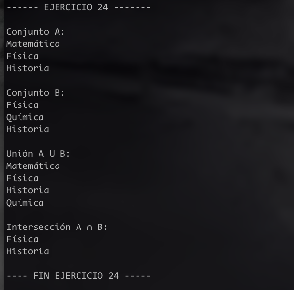
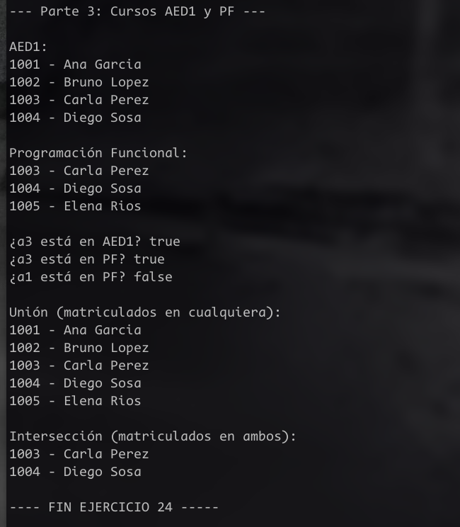

# Ejercicio 24 – Conjuntos

## Parte 1 – Algoritmos Unión e Intersección

Los conjuntos se representan con el TDA Lista simplemente enlazada, sin duplicados.

---

### Unión

**Qué hace:** dado A y B, devuelve C con todos los elementos de A y B sin repetir.

**Precondición:** A y B son conjuntos válidos (pueden estar vacíos).  
**Postcondición:** C contiene todos los elementos de A o B, sin duplicados. A y B no se modifican.

**Seudocódigo:**
```
union(A, B) devuelve C
  C es un Conjunto vacío
  actual es A.primero
  mientras actual es distinto de nulo hacer
    C.insertar(actual.dato)
    actual es actual.siguiente
  fin mientras
  actual es B.primero
  mientras actual es distinto de nulo hacer
    si NO C.contiene(actual.dato) entonces
      C.insertar(actual.dato)
    fin si
    actual es actual.siguiente
  fin mientras
  devolver C
fin
```

**Complejidad:** copiar A es O(n). Por cada elemento de B hay que buscarlo en C — esa búsqueda es O(n) en lista enlazada. Entonces el segundo loop es O(m × n). Total: **O(n × m)**.

La intuición es que no hay forma de saber si un elemento ya está sin recorrer la lista entera, porque no está ordenada con acceso directo como un array o un set. Cada "¿ya existe?" cuesta recorrer toda la lista.

---

### Intersección

**Qué hace:** dado A y B, devuelve C con solo los elementos que están en ambos.

**Precondición:** A y B son conjuntos válidos (pueden estar vacíos).  
**Postcondición:** C contiene exactamente los elementos comunes a A y B. A y B no se modifican.

**Seudocódigo:**
```
interseccion(A, B) devuelve C
  C es un Conjunto vacío
  actual es A.primero
  mientras actual es distinto de nulo hacer
    si B.contiene(actual.dato) entonces
      C.insertar(actual.dato)
    fin si
    actual es actual.siguiente
  fin mientras
  devolver C
fin
```

**Complejidad:** por cada elemento de A (n elementos) se busca en B (m elementos) — O(m) por búsqueda. Total: **O(n × m)**.

Misma intuición que unión: la lista no permite saber si un elemento existe sin recorrerla. Si la estructura fuera un hash set, ambas operaciones serían O(n + m). Acá pagamos el costo de la búsqueda lineal en cada paso.

# Parte 2 andando!

 


# Parte 3 andando!

 
