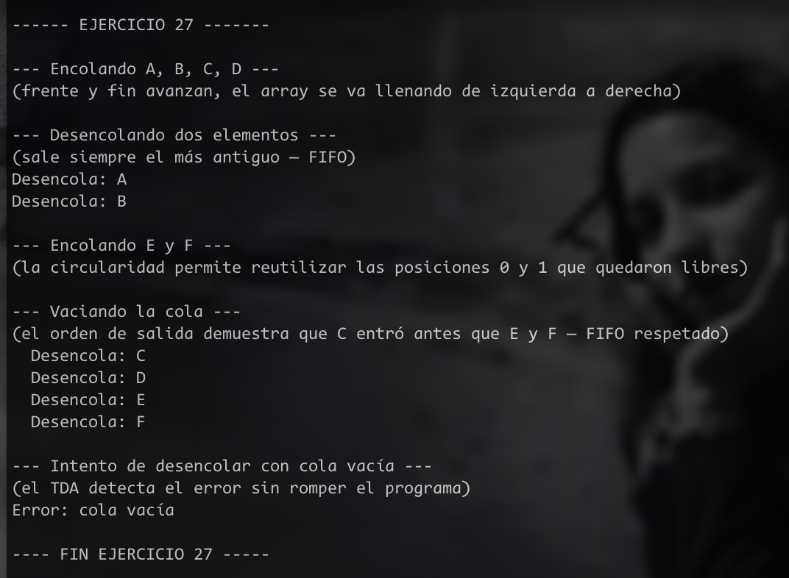

# Ejercicio 27 – Colas Circulares - mi analisis 

## Estructura interna

El vector tiene un tamaño fijo MAX. Se mantienen dos índices:
- **frente**: apunta al primer elemento (el próximo a salir)
- **fin**: apunta a la próxima posición libre (donde va a entrar el siguiente)

La cola está **vacía** cuando frente es igual a fin.  
La cola está **llena** cuando (fin + 1) mod MAX es igual a frente (se deja una posición libre como señal).

La circularidad se logra con el operador módulo: cuando un índice llega al final del array, vuelve al inicio.

---

## PoneEnCola

**Descripción:** agrega un elemento al final de la cola si hay espacio.

**Precondición:** la cola no está llena.  
**Postcondición:** el elemento queda en la posición fin, y fin avanza una posición.

```
PoneEnCola(elemento) 
  si (fin + 1) mod MAX es igual a frente entonces
    error: cola llena
  sino
    vector[fin] es elemento
    fin es (fin + 1) mod MAX
  fin si
fin
```

La clave del módulo: si fin vale MAX-1 y le sumamos 1, da MAX, y MAX mod MAX da 0 — vuelve al inicio del array. Así se forma el círculo.

---

## QuitaDeCola

Para que esto pueda hacerse, la cola no debe estar vacía.  
y para que se cumpla el elemento del frente es devuelto, y frente avanza una posición.

```
QuitaDeCola() devuelve elemento
  si frente es igual a fin entonces
    error: cola vacía
  fin si
  elemento es vector[frente]
  frente es (frente + 1) mod MAX
  devolver elemento
fin
```

Mismo razonamiento con el módulo: frente avanza circularmente sin necesidad de mover ningún elemento del array.

---


## Resultado del ejercicio 

 


### Explicación
